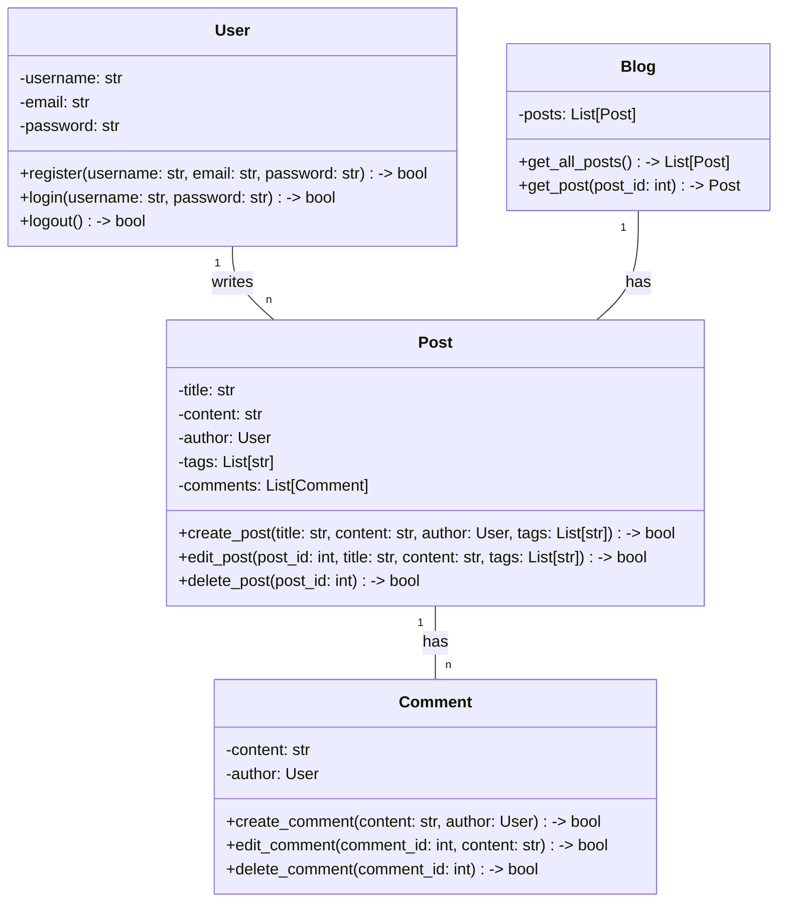
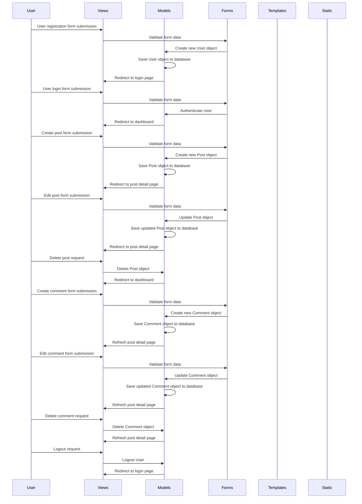

## Implementation approach:
For the implementation approach, we will use the Django framework, which is a high-level Python web framework that follows the model-view-controller (MVC) architectural pattern. Django provides a robust set of tools and features for building web applications, including user authentication, database management, and template rendering. It also has a large and active community, which ensures good support and availability of open-source packages.

To ensure compliance with PEP8 standards, we will use the Flake8 tool, which is a Python library that checks the code against PEP8 guidelines and provides warnings and suggestions for improvement. This will help us maintain a clean and consistent codebase.

For the database management, we will use PostgreSQL, an open-source relational database management system. PostgreSQL is known for its reliability, scalability, and performance, making it a suitable choice for our blogging platform.

To enhance the user interface and provide a modern and responsive design, we will use the Bootstrap framework. Bootstrap is a popular open-source CSS framework that provides a collection of pre-designed components and styles, making it easy to create a visually appealing and user-friendly interface.

## Python package name:
```python
"blogging_platform"
```

## File list:
```python
[
    "main.py",
    "models.py",
    "views.py",
    "forms.py",
    "urls.py",
    "templates/",
    "static/"
]
```

## Data structures and interface definitions:


## Program call flow:


## Anything UNCLEAR:
There are no unclear points.